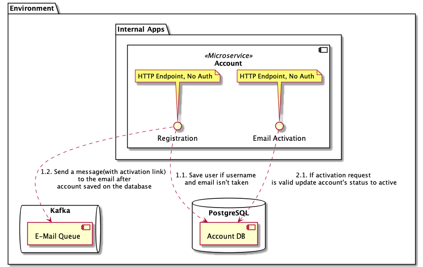

# Account Micro Service #

Account MS responsible for saving, updating and getting account.

## Component diagram ##

### Registration Flow ###

1. Registration request with username, email and password
2. Validation of parameters regarding to the regex
3. Check username or email has already been taken
4. Save a new account to the database
5. Create email message with activation link
6. Send the message to the kafka as pb
7. Return successfull message

### Account Activation Flow ###

1. Receive parameters (Activation code and email) as query params
2. Update account's status on the db if there is an account with specified parameters
3. If sucessfully updated send account activation message to kafka
4. Return successful message
